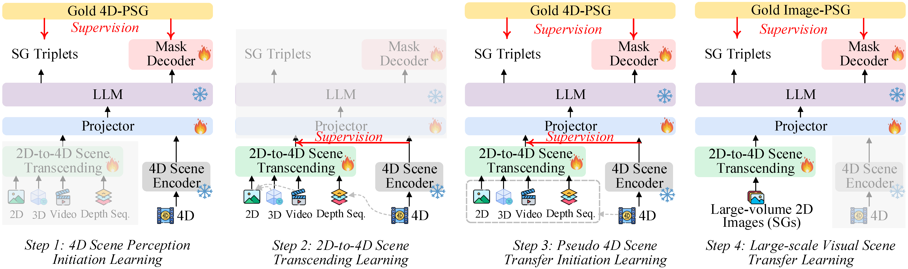

## <div align="center"> 4D Panoptic Scene Graph Generation<div>


##### <div align="center"> <a href="https://chocowu.github.io/">Shengqiong Wu</a><sup>1</sup>, <a href="https://haofei.vip/">Hao Fei</a><sup>1*</sup>,  <a href="https://jingkang50.github.io/">Jingkang Yang</a><sup>2</sup>, <a href="https://lxtgh.github.io/">Xiangtai Li</a><sup>2</sup>, <a href="https://person.zju.edu.cn/juncheng">Juncheng Li</a><sup>3</sup>, <a href="https://personal.ntu.edu.sg/hanwangzhang/">Hanwang Zhang</a><sup>2</sup>, and <a href="https://www.chuatatseng.com/">Tat-Seng Chua</a><sup>1</sup> <div>
##### <div align="center"> (*Correspondence) <div>


## Motivation and Method

The latest emerged 4D Panoptic Scene Graph (4D-PSG) provides an advanced-ever representation for comprehensively modeling the dynamic 4D visual real world.
Unfortunately, current pioneering 4D-PSG research can largely suffer from data scarcity issues severely, as well as the resulting out-of-vocabulary problems; also, the pipeline nature of the benchmark generation method can lead to suboptimal performance.
To address these challenges, this paper investigates a novel framework for 4D-PSG generation that leverages rich 2D visual scene annotations to enhance 4D scene learning.
First, we introduce a 4D Large Language Model (4D-LLM) integrated with a 3D mask decoder for end-to-end generation of 4D-PSG.
A chained SG inference mechanism is further designed to exploit LLMs' open-vocabulary capabilities to infer accurate and comprehensive object and relation labels iteratively.
Most importantly, we propose a 2D-to-4D visual scene transfer learning framework, where a spatial-temporal scene transcending strategy effectively transfers dimension-invariant features from abundant 2D SG annotations to 4D scenes, effectively compensating for data scarcity in 4D-PSG.


  


## Data
* The main task dataset is [PSG4D](), please refer the instruction []() for preparation. 

* In the 2D-to-4D visual scene transfer learning, the datasets we leverage are: 
    - [DTML](data/DIML/README.md)
    - [Action Genome](data/AG/README.md)
    - [Visual Genome](data/VG/README.md)
    - [Panoptic Scene Graph](data/PSG/README.md)

Please follow the instructions to prepare the datasets. 


## Training
Coming soon.


## Citation

If you use PSG-4D-LLM in your project, please kindly cite:
```
@inproceedings{wu2025psg4dllm,
    title={Learning 4D Panoptic Scene Graph Generation from Rich 2D Visual Scene},
    author={Shengqiong Wu and Hao Fei and Jingkang Yang and Xiangtai Li and Juncheng Li and Hanwang Zhang and Tat-Seng Chua1},
    booktitle={CVPR},
    year={2025}
}
```


## Acknowledgement

Our 4D-LLM is developed based on the codebases of [NExT-Chat](https://github.com/NExT-ChatV/NExT-Chat), [Chat-UniVi](https://github.com/PKU-YuanGroup/Chat-UniVi), [SA-Gate](https://github.com/charlesCXK/RGBD_Semantic_Segmentation_PyTorch), and [Sam2](https://github.com/facebookresearch/sam2), and we would like to thank the developers of both.